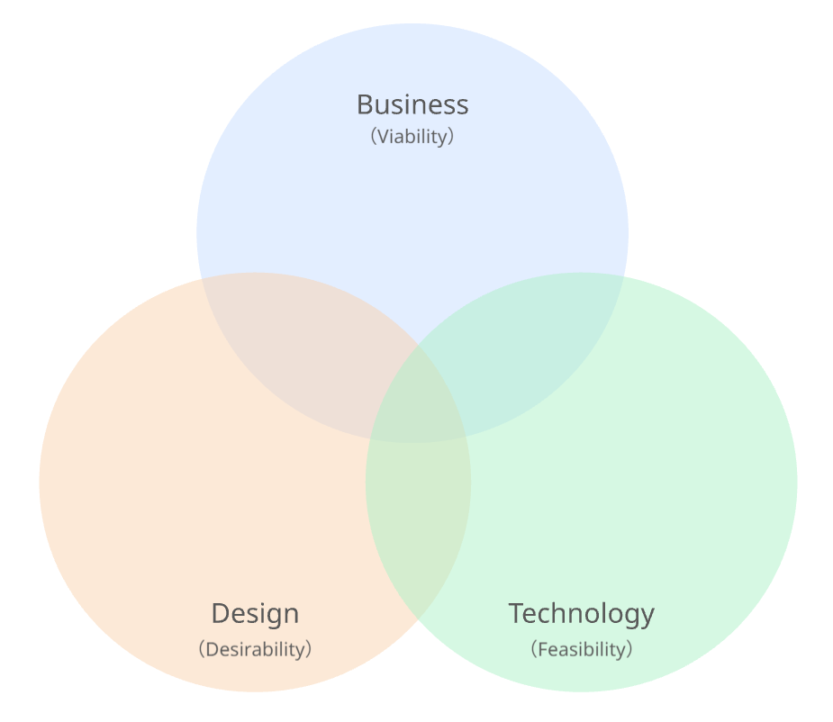
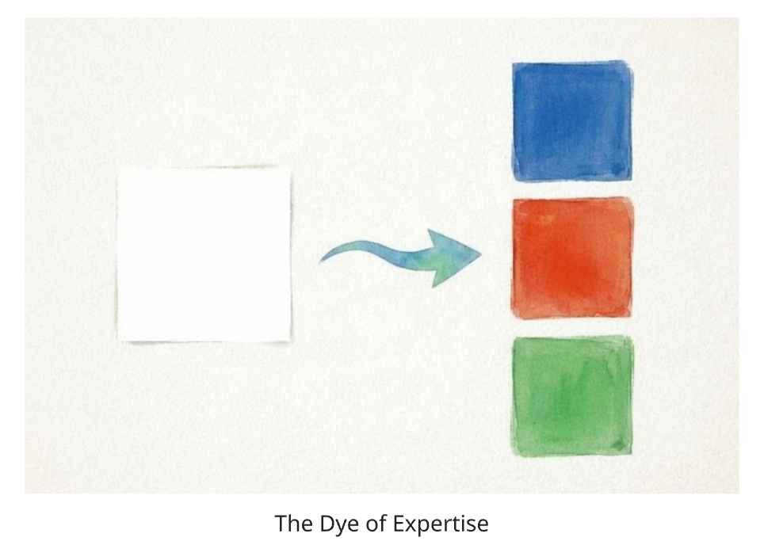
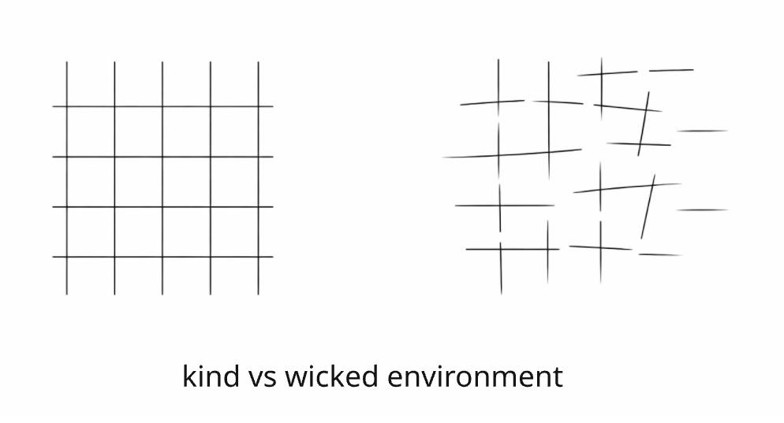
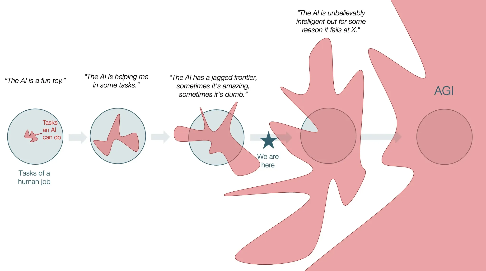
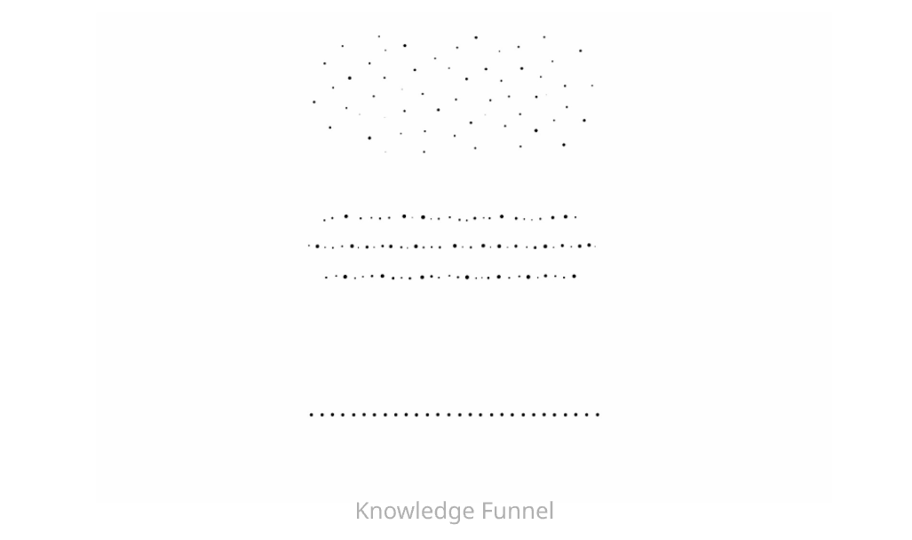
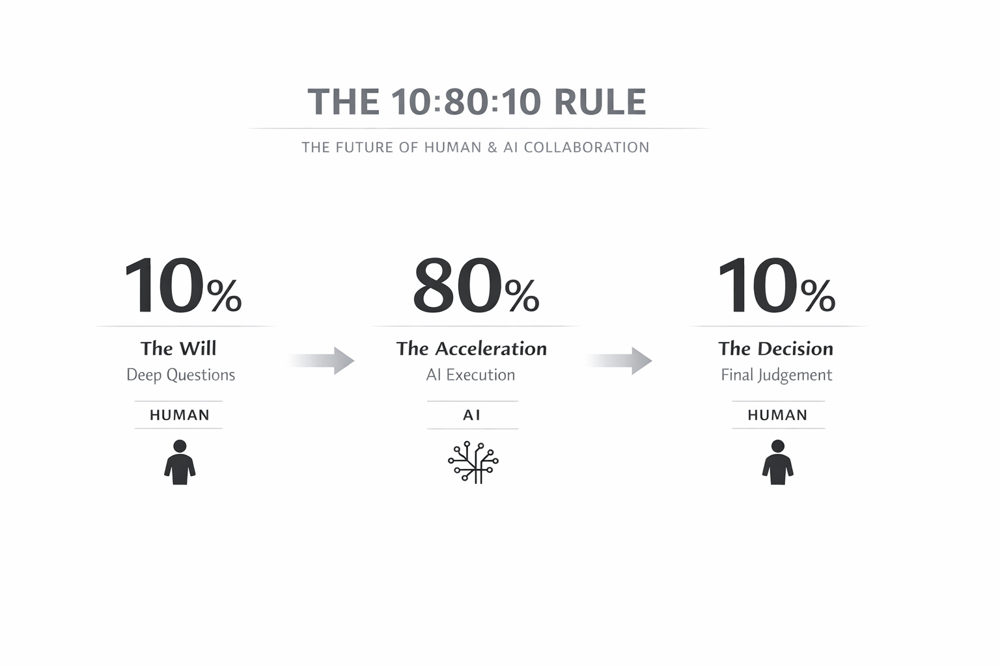
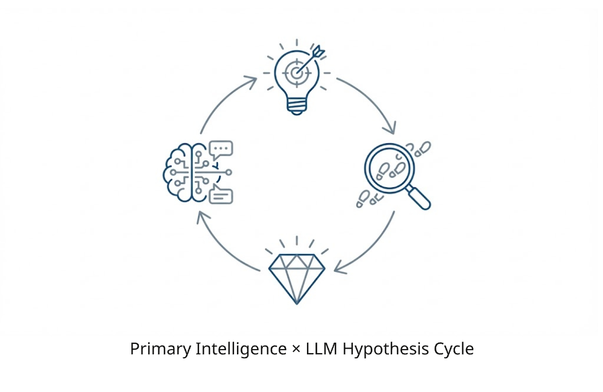
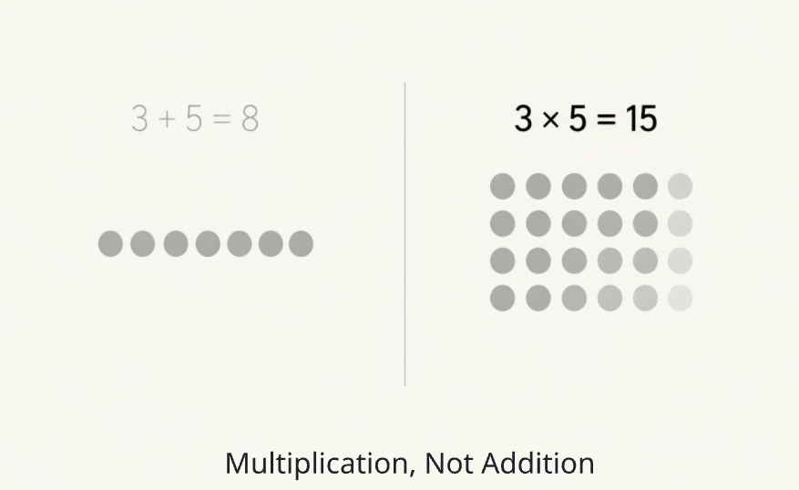
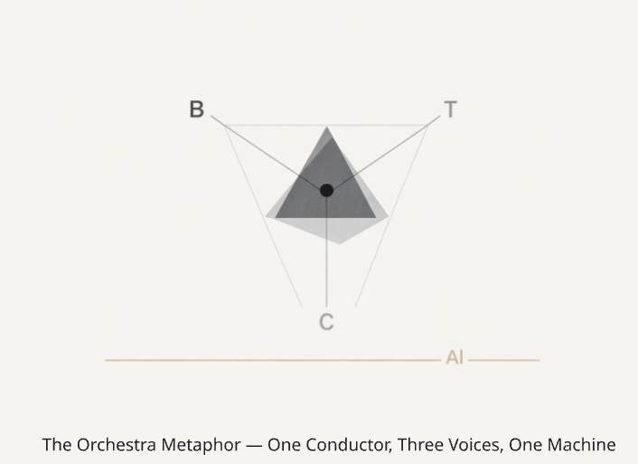
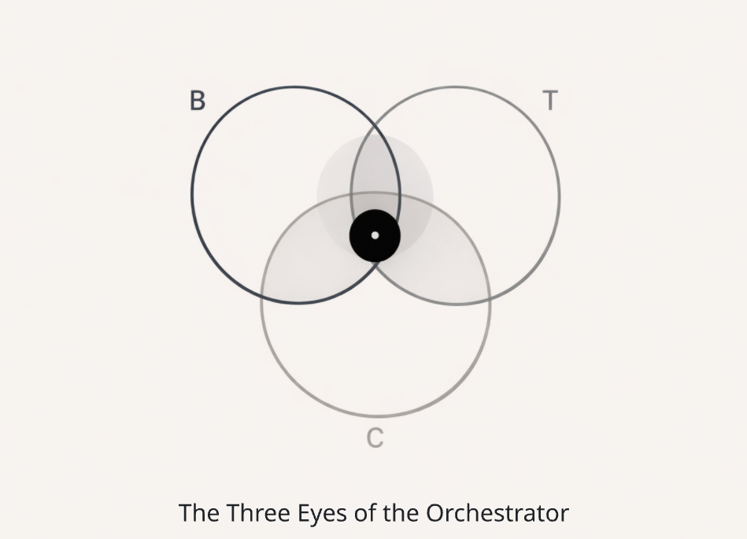

# The Orchestrator — The Rarest Role in the AI Era
**A single expertise loses to AI.**  
**The person who integrates three expertises — Business × Technology × Creative — and orchestrates both humans and AI**  
**— that is the Orchestrator of the AI era, and no one has defined it yet.**

   

 

---

# Chapter 1: Three Worlds, Three Languages

## We Are Speaking Different Languages

Picture a conference room.

On one side of the table sits someone holding a business plan. Revenue models, market size, competitive analysis, payback periods. What occupies their mind: "Is this business sustainable?" "How do I persuade the stakeholders?" "How much return will this generate in three years?"

On the opposite side sits someone with user research materials spread out. Personas, customer journeys, experience design, insights. What occupies their mind: "Will this experience move someone's heart?" "Have I grasped the real problem of a single individual with sufficient resolution?" "Is this stripped down to a beautifully lean structure?"

And there is a third person, studying a system architecture diagram. Technology selection, API design, scalability, security. What occupies their mind: "Can this design handle production workload?" "Is there a single line of code that could cause a system failure?" "Is the overall architecture — including operations and maintenance — sound?"

All three are discussing the same product. Yet the landscapes they see are entirely different.

The business expert speaks in the language of proving what is "right." Logic, numbers, structured evidence. Decisions are made through rationality, and emotion is treated as noise to be eliminated.

The creative expert speaks in the language of designing what is "beautiful." Experience, emotion, intuition, white space. They capture the real-life problems of a single human being at microscopic resolution and create designs that move that person's heart. They grasp what numbers alone cannot reveal, through sensibility.

The technology expert speaks in the language of building what "works." Code, architecture, protocols, tests. No matter how brilliant the strategy or how moving the design, nothing exists in this world until technology implements it. And that implementation carries an enormous weight of constraints and responsibilities invisible from the outside.

Each of the three is a highly skilled professional in their respective domain. Not one of them is inferior. Yet they make decisions through different cognitive circuits and describe the world in different languages.

## Business, Technology, Creative — Three Expertises

Countless industries, sectors, and specialists exist in this world. But when you raise the level of abstraction by one degree, from the perspective of human talent, the world divides broadly into three expertises.

**Business**, **Technology**, and **Creative**.

This classification originates in the BTC (Business, Technology, Consumer experience) framework proposed by Hideshi Hamaguchi, a world-renowned business designer. Hamaguchi defined these three fields as the domains where innovation should occur. Having created the world's first USB flash drive concept and led over 160 innovations, Hamaguchi demonstrated through statistical analysis that the era when technology differentiation alone could produce winners had ended — whereas innovation once occurred almost exclusively in the technology domain.

The person who translated this concept into a "talent" perspective was Kinya Tagawa, CEO of Takram. In his book *Innovation Skill Set*, Tagawa identified Business, Technology, and Creativity as the three requisites for innovation-driving talent and systematized the concept of "boundary crossing" between expertises.

The business expert stewards profitability, stakeholder relationships, communication, logical thinking, and the design of sustainable systems. The creative expert captures N1 — a single customer — at ultra-high resolution from a micro perspective, grasps the problem and insight, and creates designs and experiences that move the human heart. The technology expert builds competitive advantage through technology, designs service feasibility, and ensures operations, safety, and security.

| Expertise | Value Delivered | Cognitive Characteristics | Language of Inquiry |
|---|---|---|---|
| **Business** | Viability | Profitability, stakeholder dynamics, logical thinking | The language of proving what is "right" |
| **Creative** | Desirability | N1 ultra-resolution, insights, experience design | The language of designing what is "beautiful" |
| **Technology** | Feasibility | Architecture, implementation, operations & security | The language of building what "works" |

   

Each of these three possesses an independent system of thought and interprets the world through its own evaluative criteria.

## The Dye of Expertise

Every person begins their career in one of these three domains.

When you first enter the workforce, you are a blank canvas, unstained by any color. But as you build a career within a single domain, the cognitive and behavioral characteristics of that profession take shape. Business people develop the habit of thinking in logic. Creative people develop the habit of judging through sensibility and experience. Technology people develop the habit of thinking in implementation constraints and architecture.

   

 

This is natural, and in fact desirable. Without deepening expertise, no professional is born. The craftsperson who masters a single path deserves the highest respect.

However, this "dyeing" has a side effect.

The deeper the expertise, the more invisible the world beyond that color becomes. Business people grow frustrated: "Why does such a simple feature cost so much?" Technology people grow frustrated: "The business side understands nothing about technical constraints." Creative people feel: "They're ignoring user experience and deciding by numbers alone." Business people think: "Design is about appearance — it has nothing to do with business decisions."

These frustrations are not a matter of competence. They are a matter of language.

Despite discussing the same product, the same customer, the same market, the three expertises describe the world in different languages. Because no one exists to translate between those languages, disconnection is born.

## The Cost of Disconnection

This disconnection is not an abstract cultural issue. It generates concrete business costs.

In operating companies, there exist departments that plan the business and departments that implement, release, and operate it as a system. What occurs in many organizations is a structural conflict between these two. The business side fails to understand the design, validation, and testing workload required when translating their requests into engineering terms. The systems side fails to understand business priorities and the pace of the market.

The same disconnection exists between business and creative. Roger Martin (former Dean of the Rotman School of Management, University of Toronto) argued in *The Design of Business* that enterprises are excessively biased toward analytical thinking, and that innovation cannot emerge without integrating design thinking. More than fifteen years after Martin's observation, this disconnection remains unresolved in most companies.

John Maeda (VP AI & Design at Microsoft, former professor at MIT Media Lab, former president of RISD) published the "Design in Tech Report" annually for a decade starting in 2017, conducting a longitudinal observation of the intersection of design, technology, and business. What he repeatedly pointed out was the structural problem that innovation cannot happen when these three domains remain isolated from each other. Maeda called the talent standing at this intersection the "humanist technologist" — someone who understands technology and can integrate humanity into design, the kind of person most needed in the 21st century.

In short, the world's foremost intellects are pointing to the same structural problem. The three worlds of Business, Technology, and Creative each speak their own language and operate by their own logic. And the person who simultaneously understands, translates, and integrates all three languages is critically absent.

This book offers one answer to that absence.

Before revealing what that answer is, we must first turn our eyes to the structural change now confronting us — the reality that artificial intelligence is rewriting the very meaning of expertise.

### References

- Hideshi Hamaguchi, *SHIFT: The Art of Innovation*, Diamond, 2019 https://www.amazon.co.jp/dp/B07SRGWGK2
- Kinya Tagawa, *Innovation Skill Set*, Daiwashobo, 2019 https://www.amazon.co.jp/dp/4479797068
- Roger Martin, *The Design of Business: Why Design Thinking Is the Next Competitive Advantage*, Harvard Business School Press, 2009 https://www.amazon.com/dp/1422177807
- John Maeda, *How To Speak Machine: Computational Thinking for the Rest of Us*, Portfolio/Penguin, 2019 https://www.amazon.com/dp/039956442X
- John Maeda, *Design in Tech Report* (2017–2024) https://designintech.report

 

---

# Chapter 2: Why a Single Expertise Is Fragile in the AI Era

## The Golden Age of Specialization

In 1776, Adam Smith opened *The Wealth of Nations* with the example of a pin factory. One worker drew out the wire, another cut it, another sharpened the tip. By dividing the process into eighteen operations, ten workers could produce 48,000 pins a day. If a single worker attempted every operation alone, twenty pins a day would be the limit.

This "principle of division of labor" became the foundation of every industry from the Industrial Revolution to the present. The deeper you specialized, the higher productivity climbed, economies grew, and living standards improved. Physicians specialized by organ. Lawyers specialized by jurisdiction. Engineers split into front-end and back-end. Designers subdivided into UI, UX, and brand.

For 250 years, the premise that "deepening a single domain is the correct career strategy" went almost unquestioned. The job market evaluated people by "What is your expertise?" HR systems defined grades by the depth of specialization. Universities continued to subdivide departments and majors.

It was correct. At least, in an era when humans alone bore the weight of intellectual labor.

## AI Rewrote the Equation

In November 2022, OpenAI released ChatGPT. In the roughly two and a half years since, large language models (LLMs) have evolved at an exponential pace. Frontier models — GPT-4, Claude, Gemini — can now summarize legal documents, generate code, produce market-analysis reports, prototype UI designs, and even review academic papers in seconds: tasks that once required specialists.

A research team at the Massachusetts Institute of Technology (MIT) found that high-skill workers using generative AI improved their performance by approximately 40% compared with those who did not.

A 2024 study by the Federal Reserve Bank of St. Louis revealed that workers who use generative AI on the job save an average of 5.4% of their working hours — roughly 2.2 hours in a 40-hour week.

Looking only at the numbers, AI appears to be nothing more than a tool that boosts human productivity. But what is happening structurally is far more than a productivity gain.

**What AI is compressing is "execution" itself.**

Writing a business plan, implementing source code, designing a user-interview script, compiling a competitive-analysis report. These acts of "execution" once constituted the bulk of a specialist's value. When clients paid consultants premium fees, they were paying not only for "the ability to think" but also for "the ability to turn thought into polished output."

AI has begun to take that execution.

To be precise, it is not "taking" execution — it is "driving the cost of execution toward zero." Martin Casado of Andreessen Horowitz pointed out that "generative AI is driving the cost of creation close to zero." When execution cost approaches zero, "the ability to execute" ceases to be a differentiator.

## The Collapse of the "Kind" World

Here, the distinction between "kind environments" and "wicked environments" — presented by David Epstein in *Range: Why Generalists Triumph in a Specialized World* — becomes critically important.

A **kind environment** is one where rules are clear, patterns repeat, and feedback is immediate. A **wicked environment** is one where rules are incomplete, patterns are obscure, feedback is delayed, and the same problem never appears twice.

| Characteristic | Kind Environment | Wicked Environment |
|---|---|---|
| Rules | Clear and fixed | Incomplete and shifting |
| Patterns | Repetitive and predictable | Obscure and one-off |
| Feedback | Immediate | Delayed and ambiguous |
| Examples | Chess, golf, classical music | New-business development, geopolitical forecasting, AI-era business strategy |
| Winner | The 10,000-hour specialist who specialized early | The boundary crosser with broad experience and cross-domain thinking |
| Relationship to AI | The domain where AI surpasses humans | The domain where AI alone cannot cope |

   

 

AI's fundamental strength lies in overwhelming processing speed and precision within kind environments. In routine execution tasks where patterns repeat, AI surpasses humans. For talent that has specialized exclusively in a single domain and optimized for kind environments, this is an existential threat.

The bulk of their expertise's value — "execution" — can now be substituted by AI, faster, cheaper, and more accurately.

## The Jagged Frontier

Then is AI omnipotent? The answer is a clear No.

A research team at Harvard Business School revealed, in the paper "Navigating the Jagged Technological Frontier," that the boundary of AI's capability has a "jagged" shape.

   
  src.: https://x.com/tomaspueyo/status/1993360931267473662?s=20

 

In domains where AI excels (inside the frontier), humans using AI demonstrated overwhelmingly higher performance. But in domains where AI struggles (outside the frontier), humans who did not use AI performed best. Humans who used AI in those areas accepted AI's output uncritically and actually degraded their performance.

The question this research poses is severe.

**"Is the task I am working on right now inside or outside the AI frontier?"**

Making this judgment correctly requires the ability to see through to the essence of the task. That is impossible with a single expertise. From the business perspective alone, technical constraints remain invisible. From the technology perspective alone, customer insights cannot be grasped. From the creative perspective alone, the sustainability of the revenue structure cannot be assessed.

If AI's frontier is "jagged," then reading its ridges and valleys requires perspectives from multiple expertises. A single lens cannot capture the frontier's true shape.

## John Maeda's Question

In the 2024 Design in Tech Report, "Design Against AI," John Maeda posed the question of how the discipline of design should stand in relation to AI. The word "against" carries three meanings: "in opposition to," "leaning on," and "as a backdrop." Maeda deliberately employed this polysemy to ask what stance designers should adopt in the age of AI.

This question is not addressed to designers alone. Business professionals and engineers face the exact same question.

After AI takes execution, what remains of your expertise?

The business expert retains the ability to formulate the question "What should we do?" and the decision-making ability to discern "What should we not do." AI can produce a business plan, but the judgment of "Should we enter this market or not?" can only be made within a complex context of industry structure, stakeholder dynamics, timing, and risk tolerance.

The creative expert retains the ability to grasp "the unarticulated desire buried deep within the human heart." AI can generate a UI prototype, but extracting the insight of "Why does this user behave this way?" is unreachable without the human power of microscopic observation.

The technology expert retains the ability to "survey the architecture of an entire system and foresee what will happen in a production environment." AI can generate code, but understanding the risk that a single line of error could cascade through an entire core system — and designing architecture to prevent that risk at the design stage — is impossible without battle-tested experience.

Each of these is an ability belonging to "judgment," not "execution." And this "judgment" is the most valuable territory that remains for humans in the AI era.

## A Single Eye Cannot Judge

Yet here lies a structural problem.

The business expert judges within their expertise. The technology expert judges within their expertise. The creative expert judges within their expertise.

Each judgment is correct within its own domain. But when viewed across the entire product, the entire business, the entire organization, there is no guarantee that a collection of local optima yields a global optimum.

The feature judged "most profitable" from the business perspective may severely damage the user experience. The design judged "most beautiful" from the creative perspective may be technically impossible to implement. The architecture judged "most robust" from the technology perspective may conflict with the business's speed requirements.

Until now, the assumption has been that this contradiction is "resolved by the team." Business experts, creative experts, and technology experts form a team, clashing perspectives to approximate a global optimum.

That model is not wrong. But it is insufficient for the speed and density of judgment that the AI era demands.

When running a business-validation cycle using AI, judgments — "What should I ask AI?" "Which parts of AI's output should I trust and which should I doubt?" "In which direction should I correct AI's output?" — occur continuously at intervals of minutes. If three specialists must deliberate at every judgment, the speed that AI provides is squandered.

What is needed is a single human being in whom the perspectives of Business, Technology, and Creative coexist simultaneously — a person who can render compound judgments on AI's output in real time.

In other words, talent confined to a single expertise faces two threats simultaneously in the AI era.

First, the "execution" portion of their expertise is substituted by AI, compressing their value.

Second, even when making the "judgments" that remain, they can only judge within their own expertise — unable to accurately read the jagged contour of AI's frontier, and unable either to leverage AI to the fullest or to protect themselves from AI's errors.

Adam Smith's principle of division of labor drove an extraordinary leap in human productivity over 250 years. But now that AI has begun substituting "execution" in intellectual labor, the very premise of division is shaking.

The phase of deepening expertise is not over. But the era in which deepening alone is sufficient has arrived.

How, then, should we respond to this structural change? The answer lies in the act that reverses the 250-year orthodoxy of "division" — in the act of "crossing boundaries."

### References

- Adam Smith, *An Inquiry into the Nature and Causes of the Wealth of Nations*, 1776 https://www.gutenberg.org/ebooks/3300
- David Epstein, *Range: Why Generalists Triumph in a Specialized World*, Riverhead Books, 2019 https://davidepstein.com/range/
- Dell'Acqua et al., "Navigating the Jagged Technological Frontier: Field Experimental Evidence of the Effects of AI on Knowledge Workers", Harvard Business School Working Paper 24-013, 2023 https://www.hbs.edu/ris/Publication%20Files/24-013_d9b45b68-9e74-42d6-a1c6-c72fb70c7571.pdf
- MIT Sloan, "How Generative AI Can Boost Highly Skilled Workers' Productivity", 2023 https://mitsloan.mit.edu/ideas-made-to-matter/how-generative-ai-can-boost-highly-skilled-workers-productivity
- Federal Reserve Bank of St. Louis, "Impact of Generative AI on Work Productivity", 2025 https://www.stlouisfed.org/on-the-economy/2025/feb/impact-generative-ai-work-productivity
- Wall Street Journal, "Generative AI Brings Cost of Creation Close to Zero, Andreessen Horowitz's Martin Casado Says", 2023 https://www.wsj.com/articles/generative-ai-brings-cost-of-creation-close-to-zero-andreessen-horowitzs-martin-casado-says-58e061b4
- John Maeda, *Design in Tech Report 2024: Design Against AI* https://designintech.report

 

---

# Chapter 3: The Essence of Crossing Boundaries

## Who Drew the Boundary Lines?

Chapter 1 established that the three worlds of Business, Technology, and Creative operate in different languages. Chapter 2 showed that AI is structurally compressing the value of a single expertise.

How, then, should we respond?

Before arriving at the answer, let us pose one question.

**Who drew the "boundary lines" between these three domains in the first place?**

Universities partition knowledge into faculties and departments. Companies classify talent into divisions and job titles. The job market evaluates people by "What is your expertise?" and labels their market value by "What kind of specialist are you?" HR systems define grades by the depth of specialization.

These boundary lines are not laws of nature. They are institutions created by humans. And those institutions were designed on the premise — inherited from Adam Smith's era — that "division of labor maximizes productivity."

But as the previous chapter showed, that premise is beginning to shake in the AI era. If so, the boundary lines drawn on top of it should also be questioned.

"Crossing boundaries" is the act of carrying out that questioning — not as an intellectual debate, but with one's own career and body.

## Defining Boundary Crossing

The person who most clearly defined the concept of "crossing boundaries" as a talent theory was Kinya Tagawa, CEO of Takram.

In *Innovation Skill Set*, Tagawa defined boundary crossing as follows:

> Across the three domains of Business, Technology, and Creative, it means not staying within your own expertise but proactively leaping into adjacent domains — straddling them in thought and action.

An engineer acquires design expertise and becomes a design engineer. A business professional acquires design expertise and becomes a business designer. Leaving the safe zone of one's own expertise and immersing oneself in a different system of thought — that is boundary crossing.

What matters is that boundary crossing is fundamentally different from "reading books to gain knowledge." You could read ten business books about design thinking and still never internalize the designer's cognitive process. You could read every introductory technology text and still never understand the fear and responsibility that accompany a system failure in production.

Boundary crossing is forged in the field. Working alongside professionals of different expertises in real business contexts, internalizing their language over time. It takes years. There are no shortcuts.

## Multi-Disciplinary Depth Perception — The World Becomes Three-Dimensional with Two Eyes

What does the boundary crosser gain?

Tagawa described the sensation acquired by mastering two professional domains as "multi-disciplinary depth perception":

> A person versed in multiple fields gains what might be called 'multi-disciplinary depth perception.' That is, when looking at a single problem from the perspectives of multiple fields, a different landscape appears for each perspective. 'Boundary-crossing nature' demonstrates the value of grasping the three-dimensionality of a problem by wielding the resolution of a specialist — and doing so from multiple angles.

"Grasping the three-dimensionality of a problem" — this expression captures the essence of boundary crossing in a single phrase.

   

 

For someone with only a single expertise, a problem appears flat. Through the business eye alone, the problem sits on the plane of profitability and market size. Through the technology eye alone, it sits on the plane of feasibility and architecture. Through the creative eye alone, it sits on the plane of user experience and insight.

But for someone with two eyes, the problem rises into three dimensions. The person who holds both the business eye and the creative eye can see the contradiction: "Profitable, but it won't move anyone's heart." The person who holds both the technology eye and the business eye can see the contradiction: "Technically possible, but it won't meet the business's speed requirement."

Seeing contradictions is the wellspring of value. Because you can see the contradiction, you can conceive a third solution that resolves it.

Tagawa called this cognitive process "the pendulum of thought":

> The pendulum of thought means not being confined to a single framework, but swinging rapidly between two (or more) poles and finding the answer in the blurred afterimage of that oscillation.

"Finding the answer in the blurred afterimage of oscillation" — this poetic expression accurately describes the cognitive state that only boundary crossers reach. It is not a matter of planting one foot in either expertise and judging from there. It is oscillating at high speed between two poles and finding a solution at a "third point" that belongs to neither.

## Dispelling the Myth of the "Jack of All Trades"

Here we must confront a concern that many people hold.

"If I spread myself across multiple domains, won't I end up mediocre at all of them? Won't I just become a jack-of-all-trades generalist?"

This concern overlooks a critical premise. Boundary crossing is not "knowing a little about a lot." **It is "acquiring, in each of multiple domains, enough depth to hold your own in a discussion with that domain's professionals."**

In *Range*, David Epstein studied the characteristics of generalists who outperform specialists, citing Daniel Kahneman's (Nobel laureate in economics) research to distinguish "kind environments" from "wicked environments." The conclusion is clear. In kind environments where patterns repeat, specialists win. But in wicked environments where rules are unclear and patterns hard to discern, people with experience across multiple domains outperform specialists.

The modern business environment — the velocity of technological evolution, market uncertainty, complexity of customer behavior — is a wicked environment by definition. Epstein showed with data that in this environment, a person with cross-domain experience makes higher-quality judgments than someone who has spent 10,000 hours mastering a single field.

Gunpei Yokoi of Nintendo is known for the concept of "lateral thinking with withered technology." Rather than chasing the cutting edge, he took technologies that had already matured (and dropped in cost) and applied them in different contexts, creating the revolutionary product Game Boy. Epstein introduced this as a demonstration of the power of cross-domain knowledge application.

This is the polar opposite of "broad and shallow." Yokoi could horizontally deploy "withered technology" precisely because he deeply understood the essence of that technology. Surface-level knowledge makes application to a different context impossible. What boundary crossers need is not breadth of shallow knowledge but essential understanding at depth, across multiple domains.

## Innovation Can Be Reproduced

The person who proved the value of boundary crossing at an even deeper level is Hideshi Hamaguchi.

Hamaguchi graduated from the Faculty of Engineering at Kyoto University, joined Matsushita Electric Works (now Panasonic), handled R&D and strategic-investment decision analysis, then joined the American design consultancy Ziba, where he created the world's first USB flash drive concept. From engineering (R&D) to strategic decision analysis to design consulting — his career itself is a trajectory of boundary crossing across Business, Technology, and Creative.

Hamaguchi's greatest contribution to the world is proving that "innovation is reproducible."

It is commonly believed that innovation is born from the flash of genius — unpredictable, person-dependent, unreproducible. But through over 700 projects, Hamaguchi diagrammed the process by which innovation is born and constructed it as a reproducible model. "I have no problem at all with projects where I have zero domain knowledge," Hamaguchi himself declares — and the most difficult assignments from corporations around the world are brought to him regardless of industry. Despite reportedly commanding the highest consulting fee in the United States.

At the core of Hamaguchi's methodology is "bias break." Every human carries biases — preconceptions. By structuring and visualizing those biases and then breaking the pattern, innovative ideas emerge. Hamaguchi called this process "structured chaos" — the intermediate state between structure and chaos. Innovation exists not in the purely logical state of structure, nor in the purely intuitive state of chaos, but in the space between.

What deserves attention here is that Hamaguchi's "structured chaos" describes the same cognitive process as Tagawa's "pendulum of thought" — from a different angle. What Tagawa expressed as "oscillating at high speed between two poles," Hamaguchi expressed as "standing in the intermediate state between structure and chaos." The words differ, but they point to the same cognitive state.

**Standing between two different systems of thought, and seeing the world from a point that belongs to neither.**

This is the cognitive mode permitted only to boundary crossers, and the structural reason why innovation is reproducible.

## The Knowledge Funnel — Mystery, Heuristic, Algorithm

Roger Martin explained the intellectual architecture of boundary crossing through a different framework.

   

 

In *The Design of Business*, Martin presented the "Knowledge Funnel" — the process by which knowledge is progressively refined from Mystery to Heuristic to Algorithm.

Mystery is the state of "not knowing what is happening." An inexplicable phenomenon is occurring in the market. Customers are behaving in ways that defy rational explanation. At this stage, analytical thinking is nearly useless — because no pattern is yet visible.

Heuristic is the state where a rule of thumb has formed: "If you do this, it tends to work." Patterns have begun to emerge, but they are not yet fully formalized. Intuition and experience hold sway.

Algorithm is the state where a formula has been established: "For this input, this output is produced." Reproducibility is high, it can be documented in a manual, and eventually codified and automated.

The crux of Martin's insight is his observation that companies have tilted too far toward the "Algorithm" end of the Knowledge Funnel. Analytical thinking is powerful at the Heuristic and Algorithm stages. But at the Mystery stage — where you do not even know what the problem is — analytical thinking is helpless. Confronting Mystery requires design thinking.

The boundary crosser can traverse every stage of the Knowledge Funnel. They confront Mystery (What is happening?) with creative sensibility, articulate Heuristic (What tends to work?) with business structuring power, and formalize Algorithm (How do we automate it?) with technological implementation capability.

A person confined to a single expertise can add value only at a specific stage of the Knowledge Funnel. A boundary crosser can guide a problem from the entrance of Mystery all the way to the exit of Algorithm.

## What Blocks Boundary Crossing

Even after understanding the value of boundary crossing, some readers will hesitate to act on it.

That is natural. Boundary crossing faces three barriers.

**The first barrier is fear.** Your expertise is also your identity, built up over an entire career. Leaving that safe zone and plunging into a domain where you are a novice means the collapse of self-evaluation. You must endure the state of "knowing nothing in this domain."

**The second barrier is institutional structure.** The job market evaluates people by "What kind of specialist are you?" HR systems define grades by depth of specialization. A person who has crossed boundaries risks being seen as "mediocre" by every specialist camp. Because institutions do not reward boundary crossing, the rational choice is to stay put.

**The third barrier is time.** Boundary crossing cannot be completed at a desk. You must accumulate real-world experience in the field of a different domain. Reaching a level where you can hold your own in a discussion with professionals in that domain takes years. To cross into a second and then a third domain can consume more than a decade of a career.

These barriers are real. But precisely because they are real, the person who crosses boundaries is rare — and because they are rare, their market value is high.

The reason Hideshi Hamaguchi can command reportedly the highest consulting fee in the United States is not the breadth of his knowledge. It is because he crossed boundaries across three domains, achieved professional-level depth in each, and integrated them to make innovation reproducible.

Kevin Bethune (founder of dreams • design + life, MIT Press author) started in engineering at Westinghouse, moved through product design at Nike, then practiced the integration of design and business at BCG Digital Ventures. The title of his book — *Nonlinear* — says it all: the career path of boundary crossing is not linear. But it is precisely that nonlinearity that produces the integrative perspective.

Boundary crossing is not a matter of talent. It is a matter of courage.

The courage to leave the comfort of your expertise and leap into the unknown. The courage to endure being a novice in that domain at first. The courage to keep walking for years until you acquire a new eye.

What is needed is not special talent. Only the courage to take the first step.

But this book does not intend to end with "Cross boundaries." Boundary crossing is the departure point, not the destination. When the multiple eyes gained through crossing are equipped with a new "weapon" for the AI era, there is a place you arrive at.

The next chapter addresses that weapon — the Thinking OS.

### References

- Kinya Tagawa, *Innovation Skill Set*, Daiwashobo, 2019 https://www.amazon.co.jp/dp/4479797068
- Hideshi Hamaguchi, *SHIFT: The Art of Innovation*, Diamond, 2019 https://www.amazon.co.jp/dp/B07SRGWGK2
- David Epstein, *Range: Why Generalists Triumph in a Specialized World*, Riverhead Books, 2019 https://davidepstein.com/range/
- Roger Martin, *The Design of Business: Why Design Thinking Is the Next Competitive Advantage*, Harvard Business School Press, 2009 https://www.amazon.com/dp/1422177807
- Kevin Bethune, *Nonlinear: Navigating Design with Curiosity and Conviction*, MIT Press, 2025 https://mitpress.mit.edu/9780262049436/nonlinear/
- Kunihiro Saso, "Intersection of Business and Design" blog https://idllife.blogspot.com/

 

---

# Chapter 4: The Thinking OS — The Weapons for Those Who Command AI

## Eyes Alone Are Not Enough

Chapter 3 argued the value of the "multi-disciplinary depth perception" gained through boundary crossing. A person who has crossed boundaries across multiple domains of Business, Technology, and Creative can see worlds invisible to someone with a single expertise. They grasp the three-dimensionality of a problem and find solutions between two poles through the pendulum of thought.

Yet having eyes is not sufficient.

No matter how superb your multi-disciplinary depth perception, without "weapons" to translate it into execution, the world the boundary crosser sees remains locked inside their head. Concepts end as concepts, and no output is born.

In the pre-AI era, conceptual power itself was scarce. A person who could capture a problem with a multi-dimensional perspective, structure it, and articulate it held overwhelming value by that fact alone. Execution could be delegated to a team.

But in the AI era, the cycle from concept to execution has been compressed to the extreme. The moment you conceive, you are in dialogue with AI — testing hypotheses, generating prototypes, correcting, re-testing. This cycle turns in minutes. There is no temporal luxury to "delegate to a team" between concept and execution.

For the boundary crosser to realize their true value in the AI era, they must equip, in addition to the "eyes" of multi-disciplinary depth perception, a "Thinking OS" for commanding AI at will.

This chapter presents the five weapons that compose that Thinking OS.

## Weapon 1: The 10:80:10 Rule — The Golden Ratio of Human–AI Co-Creation

   

The foundation of the Thinking OS is "the 10:80:10 Rule."

This is a model defining the optimal division of roles between human and AI in the generative AI era, systematized as the core concept of "Depth & Velocity (D&V)" — a methodology for new-business development in the age of generative AI.

**The first 10%: The human formulates the "question."** What should we solve? Which direction should we head? What is the essential problem? This "question design" cannot be delegated to AI. AI is a machine that only begins to move once a question is given. The quality of the question determines the quality of AI's output.

**The middle 80%: AI accelerates "execution."** Research, hypothesis generation, prototype creation, data analysis, document writing. By delegating these execution tasks to AI, a single person's productivity expands dramatically.

**The final 10%: The human renders "judgment."** Is AI's output correct? Should we proceed in this direction? What do we adopt, and what do we discard? The ultimate decision is borne by the human, not AI. AI is a machine that strings words together by probability — it does not inherently possess criteria for "right" or "wrong."

What the 10:80:10 structure means is that AI is not a "substitute" for humans but a weapon that "extends" human thought and capability.

And here, the boundary crosser's advantage connects directly.

At the first 10% — the stage of "formulating the question" — a person with only the business perspective can formulate only business questions. A person with only the technology perspective can formulate only technical questions. But a boundary crosser with three eyes can design questions simultaneously from the directions of Business, Technology, and Creative. The quality of the question improves not by a factor of three but by a resolution that is three to the power.

At the final 10% — the stage of "rendering judgment" — the same holds. When evaluating AI's output, a person with a single expertise can judge only by their domain's criteria. The boundary crosser evaluates simultaneously on three axes — business sustainability, creative experiential value, technological feasibility — and renders a globally optimal judgment.

## Weapon 2: Critical Thinking — The Dialogue Process of "Doubting and Guiding" AI

The most dangerous thing in co-creating with AI is accepting AI's output uncritically.

One must accurately understand the operating principle of large language models (LLMs). An LLM is not "thinking." It is a machine that sequentially generates the statistically most plausible next token (word fragment), based on statistical prediction and probability. The LLM itself does not possess criteria such as "good," "bad," "right," or "wrong." Consequently, hallucination — output not grounded in fact — is in principle impossible to eliminate entirely.

Given this reality, what is demanded of the person using AI is critical thinking.

Critical thinking is the practice of not swallowing assumptions and beliefs whole, but instead asking "Is that really true?" while determining the essence and valid conclusion of a matter on the basis of evidence and logic.

In dialogue with AI, critical thinking functions through the following cycle:

1. Pose a "question" or "hypothesis" to the LLM
2. The LLM returns output
3. Evaluate with critical thinking — Is this response grounded in fact? Is the logic consistent? Are the premises flawed?
4. Identify errors or gaps, articulate them, and feed them back to the LLM
5. The LLM returns a revised version reflecting the feedback
6. Repeat the cycle until satisfactory output is achieved

What matters is that the human also learns within this cycle. The process of critically examining AI's output is simultaneously a process of questioning the premises of your own thinking. Through dialogue with AI, human thought is honed. This is the essence of using AI as a "thinking partner."

For the boundary crosser, critical thinking is especially potent — because they can examine AI's output from the perspectives of multiple expertises. Is the business logic sound but the implementation technically impossible? Is the design beautiful but the business model nonviable? This multi-angle verification is impossible with a single expertise.

## Weapon 3: Context Engineering — From Prompts to Context

In the context of AI usage, the first thing most people learn is "prompt engineering" — the technique of pre-designing the content you want the LLM to answer as a prompt text and supplying it as input.

However, prompt engineering has a structural limitation.

Prompt engineering is a "one-shot" method — seeking the answer from a single instruction. A single input returns a single output, and the exchange is disposable. Each time a new question is posed, context resets to zero.

In activities like new-business development — activities that involve uncertainty, constant change, and context information that is updated daily — this "disposable" dialogue is utterly inadequate.

Enter the concept of "context engineering."

The concept of context engineering was first proposed by Walden Yan, co-founder of US AI firm Cognition. It refers to a mechanism that automatically organizes and propagates past information, originally defined as a concept necessary for the coordination of multi-AI agents.

But this concept should be extended beyond "coordination between AI agents" to the "co-creative relationship between humans and AI." The author of this book extended the concept of context engineering to human–AI co-creation and systematized it within D&V as a practical methodology for new-business development.

Concretely, it means continuously recording, updating, and supplying — as input to every AI dialogue — the context information of a project through a "context file." The project's purpose, target, past decisions and the reasoning behind them, discovered insights, records of failure, constraint conditions. The more this context information accumulates, the more dramatically AI's output improves in precision and depth.

If prompt engineering is marksmanship seeking an answer from a "single shot," context engineering is the practice of "permanently preserving the thinking process and context, and cultivating them through dialogue."

For the boundary crosser, the value of context engineering is especially large — because observations, insights, and judgments from multiple expertises each accumulate as context information in the context file. An insight discovered through the business lens, a user's voice captured through the creative lens, a constraint identified through the technology lens. A context file integrating all of these serves as a pseudo-installation of the "boundary crosser's eyes" into AI.

## Weapon 4: Primary Intelligence × LLM Hypothesis Cycle — Breaking Through the Learning-Data Wall

LLMs have a fundamental limitation: they can only generate answers within the scope of their training data.

An LLM learns statistical patterns from a vast corpus of text. Therefore, for information not contained in its training data — for example, the raw voice of a customer heard in yesterday's interview, non-public internal data, physical constraints on the ground — the LLM in principle cannot know.

What breaks through this "learning-data wall" is the Primary Intelligence × LLM hypothesis cycle. This is a concept defined within the D&V methodology as "reaching beyond the learning data" — a reproducible process structure that compensates for the LLM's fundamental limitation with primary intelligence from the field.

Primary intelligence refers to unprocessed information directly collected by yourself. Records of customer interviews, notes from field observations, raw experimental data. These do not exist within the LLM's training data.

The cycle operates as follows:

1. Collect primary intelligence (interviews, field observation, experiments)
2. Record primary intelligence in the context file and supply it to the LLM
3. Have the LLM generate hypotheses ("What does this primary intelligence suggest?")
4. Validate the generated hypotheses in the field
5. Append validation results to the context file and reflect them in the next round of hypothesis generation

By running this cycle, the LLM breaks through the learning-data wall and can output deep insights grounded in the project's specific context.

   

 

When a boundary crosser runs this cycle, an overwhelming advantage emerges at the primary-intelligence collection stage. They capture the decision-making structure of customers in the business arena, grasp unarticulated user desires through the creative lens, and identify technical constraints and possibilities through the technology lens. The resolution of primary intelligence collected through three eyes is incomparable to that collected through a single expertise.

## Weapon 5: Four Prompt Levers for Extracting Expertise

The final weapon consists of four levers for drawing maximum expertise from AI.

An LLM possesses general knowledge, but in its default state returns only general answers. To unlock the LLM's latent potential, you must ask from the appropriate "angle."

**Lever 1: Role Setting** — Assign the LLM a specific expert role. "You are a product manager with 20 years of experience." "You are a VC partner in Silicon Valley." Setting a role shifts the LLM's output from generic answers to deep responses grounded in a specific expertise.

**Lever 2: Explicit Constraints** — Give the LLM constraints to focus its output. "In 500 words or fewer." "Based only on factual data." "From a critical perspective." Constraints do not kill creativity — they direct it.

**Lever 3: Thought-Process Specification** — Instruct the LLM on "how to think." "First decompose the structure of the problem, then analyze the causal relationships between each element, then present priorities." By making the thinking steps explicit, the quality of the LLM's reasoning improves.

**Lever 4: Output-Format Design** — Specify "how to output." "Compare in a table." "Present three options with the merits and demerits of each." By designing the output format, you make it easier for the human to evaluate and judge AI's output.

The boundary crosser can wield these four levers while fluidly switching between three expertises. When testing a business hypothesis, they set the role of a business consultant; when reviewing UI design, they switch to the role of a UX designer; when examining architecture, they set the role of a senior engineer. A single human extracting deep knowledge from three expertises through AI. This is an operation impossible for a person with only a single expertise.

## The Thinking OS in Full View

Integrating the five weapons reveals the following picture.

**The 10:80:10 Rule** is installed as the foundation (OS). The human formulates the question (10%), AI accelerates execution (80%), the human renders judgment (10%).

On top of that foundation, **Critical Thinking** ensures the quality of the dialogue with AI. Never accept AI's output uncritically — always ask "Is that really true?"

**Context Engineering** makes the dialogue's context permanent. The accumulation of project knowledge and judgment deepens AI's output with every successive round.

**The Primary Intelligence × LLM Hypothesis Cycle** breaks through the learning-data wall. Feed raw information from the field into AI, generate hypotheses, and validate them in the field again.

**The Four Prompt Levers** extract maximum expertise from AI. Wield role setting, constraints, thought process, and output format to unlock AI's latent potential.

Each of the five weapons produces a certain effect when used individually. But when all five are integrated, the effect becomes not additive but multiplicative.

And what matters most is that this Thinking OS can be installed by anyone. This is not the flash of genius. It is a logic-based discipline. Just as Hideshi Hamaguchi proved that "innovation is reproducible," co-creation with AI also becomes reproducible once the right methodology is acquired.

However, even with the same OS installed, results differ dramatically depending on who wields it.

If a person with a single expertise uses this OS, they will efficiently leverage AI within their own domain. That is valuable. But the ceiling remains within the bounds of "expertise × AI."

What happens when a person who has crossed three boundaries uses this OS?

That is the subject of the next chapter.

### References

- Satoshi Yamauchi, *Depth & Velocity: A New OS for Building Businesses in the Generative AI Era*, Leading AI, 2026, CC BY 4.0 https://github.com/Leading-AI-IO/depth-and-velocity
- Vaswani et al., "Attention Is All You Need", arXiv:1706.03762, 2017 https://arxiv.org/abs/1706.03762
- GLOBIS Graduate School of Management, *Critical Thinking*, Diamond, 2012 https://www.amazon.co.jp/dp/4478020582
- Phil Schmid, "Context Engineering", 2024 https://www.philschmid.de/context-engineering
- Hideshi Hamaguchi, *SHIFT: The Art of Innovation*, Diamond, 2019 https://www.amazon.co.jp/dp/B07SRGWGK2

 

---

# Chapter 5: The Integration of Eyes and Weapons — The Birth of the Orchestrator

## The Moment Two Conditions Converge

This book has so far addressed two conditions separately.

Chapters 1 through 3 spoke of the "eyes." That the three worlds of Business, Technology, and Creative operate in different languages. That AI is compressing the value of a single expertise. And that boundary crossing can yield multi-disciplinary depth perception.

Chapter 4 spoke of the "weapons." The 10:80:10 Rule, critical thinking, context engineering, the primary intelligence × LLM hypothesis cycle, the four prompt levers. The Thinking OS for commanding AI at will.

This chapter addresses what happens the moment these two converge.

The conclusion, stated first:

**When eyes (multi-disciplinary depth perception) and weapons (the Thinking OS) are integrated within a single human being, that person becomes an "Orchestrator."**

## The Structure of Multiplication

Why does "integration" matter? Why is a team of two — one with eyes, one with weapons — insufficient?

To answer this question, picture a concrete scene.

A company is exploring a new business. The situation: running a business-hypothesis validation cycle using AI.

| Case | Eyes (Multi-Disciplinary Depth Perception) | Weapons (Thinking OS) | Result |
|---|---|---|---|
| **Case 1** | Single expertise (Business only) | Fully installed | Perfect as a business, but hits a technical wall at implementation and users churn |
| **Case 2** | Crossed three expertises | None | Brilliant concept but slow execution, left behind by the speed of the AI era |
| **Case 3** | Crossed three expertises | Fully installed | Concept and execution unify, an overwhelming cycle of speed and precision turns |

Each case, examined in detail:

**Case 1: Single Expertise × Thinking OS**

A business expert has perfectly installed the Thinking OS described in Chapter 4. Following the 10:80:10 Rule, they first formulate a question: "What unmet needs exist in this market?" They query AI, verify with critical thinking, accumulate context through context engineering.

But their questions remain within the business framework. "Is the market large enough?" "Are there barriers to competitive entry?" "Is the revenue model viable?" These are valid questions, but the scope of inquiry is confined to a single expertise.

When verifying AI's output, they can only judge by business criteria. Whether the output is technically implementable, whether it works as a user experience — these are invisible through their lens.

The result: a flawless business plan — but one that hits a technical wall at implementation and produces a product from which users churn after launch.

**Case 2: Multi-Disciplinary Depth Perception × No Thinking OS**

A person has crossed three boundaries but possesses no methodology for co-creating with AI. They can see the three-dimensionality of the problem — simultaneously recognizing business sustainability, user experience, and technical constraints.

But the process of converting that perception into concrete output is inefficient. Queries to AI start from zero each time because no context accumulates. Without a systematic process for verifying AI's output, ad hoc decisions driven by intuition continue. Not knowing how to connect primary intelligence to AI, they can only leverage AI within the learning-data wall.

The result: a brilliant concept but slow execution, left behind by the speed of the AI era.

**Case 3: Multi-Disciplinary Depth Perception × Thinking OS**

A person with three eyes has fully equipped the Thinking OS.

The landscape shifts from the very first 10%, the stage of formulating questions.

At the same moment they formulate the business question "What unmet needs exist in this market?", the creative question "What experience design should satisfy those needs?" and the technology question "What technical architecture is required to realize that experience?" fire simultaneously within a single mind.

When querying AI, they switch role settings fluidly. When examining business strategy, they set the role of a business consultant; the next moment, they switch to a UX designer's role to verify from the user-experience perspective; then they set a senior engineer's role to confirm technical feasibility. This switching occurs within a single person, at intervals of minutes.

In context engineering, too, the quality of accumulated context information is fundamentally different. Market structures discovered through the business lens, user insights captured through the creative lens, architectural constraints identified through the technology lens. As these are integrated into a single context file, AI "learns" the boundary crosser's eyes with every successive round, and output quality improves exponentially.

Critical thinking, too, is performed simultaneously from three perspectives. AI's output is verified on three axes at once: "Does this hold as a business?" "Does this move the user's heart?" "Is this technically implementable?" This multi-angle verification achieves a judgment precision unreachable by a single expertise.

The result: concept and execution unify, and a cycle of overwhelming speed and precision begins to turn.

## Multiplication, Not Addition

   

 

What must be emphasized here is that the value created by the integration of eyes and weapons is not "additive" but "multiplicative."

Suppose the value of a boundary crosser with three expertises is "3." Suppose the value of the Thinking OS is "5."

When these two belong to separate people, the team's value is "3 + 5 = 8." The boundary crosser conceives, the AI operator executes. But translation cost arises between concept and execution, and speed drops.

When these two are integrated within a single person, the value becomes "3 × 5 = 15." Translation cost between concept and execution drops to zero, and the cycle turns at the speed of thought. Because three eyes simultaneously operate every function of AI, both output quality and speed improve multiplicatively.

It is the same structure as Tagawa's observation that "with each boundary you cross, the world you can see expands not by a factor of two but by the square." The more eyes you have, and the higher the quality of the weapons those eyes are equipped with, the more value expands exponentially.

## Hideshi Hamaguchi: The Highest Peak Before AI

The person who achieved this "integration of eyes and weapons" at the highest level in the pre-AI world is Hideshi Hamaguchi.

Hamaguchi crossed the three domains of Business, Technology, and Creative (Consumer experience), achieved professional-level depth in each, and integrated them to make innovation reproducible. Over 700 projects. Reportedly the highest consulting fee in the United States. That track record is the most powerful evidence of the value that the integration of "the boundary crosser's eyes" and "a reproducible methodology (weapons)" can generate.

However, Hamaguchi's methodology was completed in the pre-AI world.

His weapons — bias break, structured chaos, the BTC framework — are exquisitely designed as human thinking methods. But the execution process still depends on human teams. The cycle of concept, execution, validation, and correction turned within the range of human processing speed.

What happens, then, when the Thinking OS of the AI era is added to Hamaguchi's peak?

The 10:80:10 Rule compresses the time between concept and execution. Context engineering permanently installs into AI the knowledge accumulated across 700 projects. The primary intelligence × LLM hypothesis cycle breaks through the learning-data wall, generating hypotheses in real time from raw field information. Critical thinking verifies AI's output through three eyes simultaneously.

By equipping the Thinking OS, more people can reach the point that Hamaguchi reached as a solitary genius.

This is the profile of talent that this book seeks to define.

## Beyond John Maeda's "Humanist Technologist"

John Maeda called the talent standing at the intersection of design and technology the "humanist technologist." Someone who understands technology and can integrate humanity into design. Former professor at MIT Media Lab, former president of RISD, and currently VP AI & Design at Microsoft — he himself continues to embody the concept.

Maeda's "humanist technologist" is an important precursor to the Orchestrator defined in this book. But its scope differs in two respects.

First, Maeda's concept is built on two axes: Design × Technology. The Business axis is not explicitly included. The Orchestrator demands the integration of all three axes, including Business.

Second, Maeda's concept positions AI as "something to stand against." "Design Against AI" — how should design stand in relation to AI? The Orchestrator does not regard AI as "something to stand against" but as "an instrument to command as an extension of one's own eyes." Not standing against AI, but conducting it.

Donald Schön's concept of "The Reflective Practitioner" is also a precursor to the Orchestrator. Schön described the process by which professionals learn through reflecting on their own actions. The boundary crosser acquires multi-disciplinary depth perception by repeating reflective practice across different domains. The Orchestrator carries out reflective practice within the dialogue with AI, running a cycle of human–AI co-evolution.

Nigel Cross academically studied the thinking methods unique to designers and described "the designer's eye" in cognitive-scientific terms. The "designer's eye" that Cross described is one of the three eyes the Orchestrator holds. This book extends its scope to the integration of all three — including the business eye and the technology eye.

In short, the Orchestrator is an entity that subsumes all these precursor concepts and extends them with the weapons of the AI era.

- Hamaguchi's "BTC boundary crossing × reproducible methodology"
- Maeda's "humanist technologist"
- Schön's "reflective practitioner"
- Cross's "designer's eye"

All of these, integrated within a single human being and further armed with the Thinking OS of the AI era.

That person is the Orchestrator.

## The Orchestra Metaphor

   

 

Why the name "Orchestrator"?

The conductor of an orchestra does not play an instrument. Yet they can read the scores of every part, understand the characteristics of every instrument, give precise instructions to each player, and integrate the performance of a hundred musicians into a single work of music.

If the conductor knew only the strings, their instructions to the winds would miss the mark. If they did not understand the nature of percussion, the rhythmic architecture of the whole would collapse. The conductor's value lies not in the ability to play any individual instrument, but in the ability to understand every part and integrate them.

The Orchestrator of the AI era operates by the same structure.

They can read the "scores" of the three "parts" — Business, Technology, and Creative. They can give precise instructions to the professionals in each domain, in their language. And by commanding AI — a powerful "instrument" — at will, they integrate the harmony of the three parts into a single product, a single business, a single organization.

A person with only a single expertise can become the "principal player" of a single part. That is a worthy existence. But they cannot stand on the conductor's podium to integrate the whole.

A generalist knows every part "broadly and shallowly." They can read the outline of each score but lack the depth to give precise instructions to each player. As a result, they elicit competent but unremarkable performances.

The Orchestrator understands multiple parts "deeply" and then integrates. They can converse in the language of each part and know, from their own experience, each player's limits and potential. That is why they can issue instructions that draw out the latent capability of every player. And with AI as an added instrument, the volume and expressive range of the orchestra expand to a dimension incomparable to the era of humans alone.

## A Podium Where No One Yet Stands

At the opening of this book, the core message was stated.

"The rarest role in the AI era is the person who understands Business, Technology, and Creative at a professional level and can orchestrate both humans and AI. That is the Orchestrator, and no one has defined it yet."

Having read this far, the meaning of those words should now be sharply in focus.

The Orchestrator is the person who integrates the three eyes gained through boundary crossing with the weapon of the AI-era Thinking OS. The point that Hamaguchi reached, updated for the AI era. Maeda's concept, extended to three axes. Epstein's proof of the generalist's advantage, elevated to "integration with depth."

No one stands on that podium yet.

But this book asserts that the podium is reachable. What is needed is not a flash of genius. It is the courage to cross boundaries and the will to acquire the Thinking OS.

The next chapter presents the concrete definition of the Orchestrator and a practical path to arrival.

### References

- Hideshi Hamaguchi, *SHIFT: The Art of Innovation*, Diamond, 2019 https://www.amazon.co.jp/dp/B07SRGWGK2
- John Maeda, *How To Speak Machine: Computational Thinking for the Rest of Us*, Portfolio/Penguin, 2019 https://www.amazon.com/dp/039956442X
- John Maeda, *Design in Tech Report 2024: Design Against AI* https://designintech.report
- Donald Schön, *The Reflective Practitioner: How Professionals Think in Action*, Basic Books, 1983 https://www.amazon.com/dp/0465068782
- Nigel Cross, *Design Thinking: Understanding How Designers Think and Work*, Berg, 2011 https://www.amazon.com/dp/1847886361
- Kevin Bethune, *Nonlinear: Navigating Design with Curiosity and Conviction*, MIT Press, 2025 https://mitpress.mit.edu/9780262049436/nonlinear/
- Kinya Tagawa, *Innovation Skill Set*, Daiwashobo, 2019 https://www.amazon.co.jp/dp/4479797068

 

---

# Chapter 6: The Definition of the Orchestrator

## Definition

Throughout this book, we have confronted a single question.

In the AI era, who is the rarest and most valuable talent?

Here, we define the answer.

---

**The Orchestrator is a person who understands the three expertises of Business, Technology, and Creative at a professional level, integrates the multi-disciplinary depth perception gained through boundary crossing with the Thinking OS of the AI era, and thereby orchestrates both humans and AI to lead seamlessly from concept to execution.**

---

The Orchestrator is not a generalist. Not a specialist. Not a manager.

| Talent Profile | Definition | Limitation |
|---|---|---|
| **Specialist** | Masters a single domain | Cannot see other domains. Execution is substituted by AI, compressing value |
| **Generalist** | Knows multiple domains broadly and shallowly | Lacks depth in each domain; cannot give precise instructions to professionals |
| **Manager** | Manages people | Does not possess the ability to conduct AI. Lacks the perspective to integrate the whole into a single work |
| **Orchestrator** | Understands multiple domains deeply, integrates them, and conducts both humans and AI | — |

This is a talent profile that no one had yet defined.

## The Three Eyes of the Orchestrator

Let us precisely redefine the three eyes the Orchestrator holds.

**The Business Eye.** The eye that sees through to profitability and sustainability. It reads the dynamics of stakeholders, dissects the structure of markets, and relentlessly asks: "Will this business still exist in ten years?" It reads the meaning behind the numbers, and understands the human decision-making structures that rationality alone cannot explain. It does not stop at drawing strategy — it structurally grasps why that strategy will not pass: the inertia of the organization, the biases of decision-makers, the conflicting interests among stakeholders — and designs the breakthrough.

**The Creative Eye.** The eye that grasps the unarticulated desire buried deep within the human heart. It observes N1 — a single customer — at ultra-high resolution and extracts insights that even the person themselves has not noticed. It knows that "correctness" alone does not move people. It gives "skin" and "warmth" to the skeleton of logic, converting a sterile business plan into "a design for people to love." The art of stripping away excess and leaving only the essence — a beautifully lean structure.

**The Technology Eye.** The eye that assesses feasibility and designs the architecture of the whole. No matter how brilliant the strategy or how moving the design, nothing exists in this world until technology implements it. It understands the entire system from hardware through OS, network, middleware, to application, and knows from experience the risk that a single line of code can cascade through an entire core system. It does not merely articulate the concept — it sees through to how it will run, how it will break, and how it must be protected in a production environment.

Each of these three eyes holds independent value. But when all three are integrated within a single person, they reach a dimension inaccessible to any single eye or any pair of two.

   

 

When the business eye and the creative eye integrate, you can conceive a business that is "highly profitable and moves the human heart." When the business eye and the technology eye integrate, you can design something "strategically sound and technically implementable." When the creative eye and the technology eye integrate, a product is born that is "beautiful as an experience and runs robustly."

And when all three integrate, a single human can render real-time judgments that simultaneously satisfy all of these: "Highly profitable, moves the human heart, technically implementable, and sustainably operable in a production environment."

## The Orchestrator's Weapons

Let us redefine, as a system, the Thinking OS the Orchestrator is equipped with.

This Thinking OS was systematized by the author of this book as "Depth & Velocity (D&V)" — a methodology for new-business development in the age of generative AI. It was not born from desk-bound theory. Over more than 15 years of a boundary-crossing career across Business, Technology, and Creative, through countless failures and gritty front-line experiences, through hitting walls alongside clients, through honing co-creation with AI in live combat — this methodology was reached. There are things that can only be forged by someone who has built both theory and practice with their own hands. This Thinking OS was born precisely in that way.

**The 10:80:10 Rule.** The human formulates the "question" in the first 10%, delegates the middle 80% to AI, and renders "judgment" in the final 10%. The Orchestrator activates all three eyes simultaneously in that first and last 10%. Questions are designed from three directions at once; judgments are verified on three axes at once.

**Critical Thinking.** The dialogue process of "doubting and guiding" AI's output. The Orchestrator verifies AI's output multi-dimensionally against three criteria: business logic, creative sensibility, and technological constraints. Multi-disciplinary depth perception catches contradictions that any single criterion would miss.

**Context Engineering.** The practice of permanently preserving and cultivating a project's context through dialogue with AI. The Orchestrator's context file integrates observations, insights, and judgments from all three expertises. That context file pseudo-installs "the Orchestrator's eyes" into AI.

**The Primary Intelligence × LLM Hypothesis Cycle.** Breaking through the learning-data wall with raw information gained in the field. Because the Orchestrator collects primary intelligence through three eyes, the resolution and multi-dimensionality of that information are fundamentally different.

**The Four Prompt Levers.** Wielding role setting, constraints, thought process, and output format to unlock AI's latent potential. The Orchestrator switches fluidly among the roles of business consultant, UX designer, and senior engineer within a single person, simultaneously extracting deep knowledge from AI across all three expertises.

## The World the Orchestrator Leads

When an Orchestrator exists within an organization, what changes?

**Disconnection disappears.** Recall the conference room from Chapter 1. The business expert holding a business plan, the creative expert with user research spread out, the technology expert studying an architecture diagram. Three people speaking different languages, unable to see each other's world.

The Orchestrator stands between these three and translates all three languages simultaneously. They convert business requirements into technological constraints, connect technological possibilities to creative experience design, and integrate creative insights into business strategy. It is not that disconnection vanishes. Rather, for the first time, the entity that bridges disconnection is defined.

**Speed changes.** In traditional organizations, the path from concept to execution required deliberation, translation, and coordination among multiple specialists. The Orchestrator integrates concept and execution within a single person and, through AI, turns cycles in units of minutes. Business-hypothesis design, user-experience prototyping, and technical-feasibility validation are completed within a single dialogue session.

**The quality of judgment changes.** The greatest risk of the AI era is accepting AI's output uncritically. A person with only a single expertise can verify AI's output only by their own domain's criteria. The Orchestrator verifies on three criteria simultaneously, accurately reading the "jagged" contour of AI's frontier and precisely judging when to trust AI and when to doubt it.

## The Path to Arrival

The Orchestrator is not made in a day.

But the path is clear.

| Stage | Content | What You Gain |
|---|---|---|
| **Stage One** | Deepen your first expertise | The foundation of professionalism. The departure point for boundary crossing |
| **Stage Two** | Cross into a second domain | The budding of multi-disciplinary depth perception. The beginning of "the pendulum of thought" |
| **Stage Three** | Cross into a third domain | A cubic expansion. An extraordinarily rare talent position |
| **Stage Four** | Install the Thinking OS | The five weapons for commanding AI at will |
| **Stage Five** | Integrate eyes and weapons | The unification of concept and execution. The birth of the Orchestrator |

   

 

**Stage One: Deepen your first expertise.** This is the departure point for everything. Whether in Business, Technology, or Creative, first reach a level recognized as professional in a single domain. Without this stage, boundary crossing is meaningless. A superficial lateral spread of knowledge produces only a jack of all trades.

**Stage Two: Cross into a second domain.** Leave the safe zone of your expertise and immerse yourself in a different system of thought. Not by reading books, but by forging in the field. Work alongside professionals of a different domain and internalize their language. At this stage, "multi-disciplinary depth perception" buds, and what Tagawa called "the pendulum of thought" begins.

**Stage Three: Cross into a third domain.** Talent with two eyes exists in reasonable numbers around the world. Business designers, design engineers, technical product managers. But talent with three eyes is extraordinarily rare. The moment the third crossing is complete, the landscape you see expands not by the square but by the cube.

**Stage Four: Install the Thinking OS.** Equip the three eyes with the weapons of the AI era. Master the 10:80:10 Rule, converse with AI through critical thinking, accumulate context through context engineering, break through AI's wall with primary intelligence, and unlock AI's latent potential with the prompt levers.

**Stage Five: Integrate eyes and weapons.** At this stage, concept and execution unify. The three eyes simultaneously operate every function of AI, and the cycle of conceiving, executing with AI, validating, and correcting begins to turn the instant a thought is formed.

These five stages may require more than a decade of a career. There are no shortcuts.

But just as Hideshi Hamaguchi proved that "innovation is reproducible," the path to the Orchestrator is also reproducible. What is needed is not a flash of genius. It is the courage to cross boundaries, the will to acquire the Thinking OS, and the resolve to keep walking for years.

## To the Podium

Finally, a question for you, the reader.

Where among the three worlds do you stand right now?

Are you in the world of Business, facing numbers and strategy? Are you in the world of Creative, designing experiences for the human heart? Are you in the world of Technology, building code and architecture?

Where you stand now is the departure point. Not the destination.

In the world next door, there is a landscape you have never seen. To see it, you must leave the safe zone of where you are and step into unknown territory. At first, you will understand nothing. You will be treated as a novice. Your self-evaluation will collapse. Yet only those who keep walking will gain a world that a single expertise can never reveal.

And those who gain a second eye will know: a third eye exists.

When the person with three eyes takes hold of the instrument called AI, the orchestra begins to sound.

That podium is still empty.

It may be you who stands there.

### References

- Satoshi Yamauchi, *Depth & Velocity: A New OS for Building Businesses in the Generative AI Era*, Leading AI, 2026, CC BY 4.0 https://github.com/Leading-AI-IO/depth-and-velocity
- Hideshi Hamaguchi, *SHIFT: The Art of Innovation*, Diamond, 2019 https://www.amazon.co.jp/dp/B07SRGWGK2
- Kinya Tagawa, *Innovation Skill Set*, Daiwashobo, 2019 https://www.amazon.co.jp/dp/4479797068
- Dell'Acqua et al., "Navigating the Jagged Technological Frontier", Harvard Business School Working Paper 24-013, 2023 https://www.hbs.edu/ris/Publication%20Files/24-013_d9b45b68-9e74-42d6-a1c6-c72fb70c7571.pdf

 

---

© 2026 Satoshi Yamauchi — Leading AI (Leading AI LLC)
This book is published under the CC BY 4.0 license.
https://github.com/Leading-AI-IO
